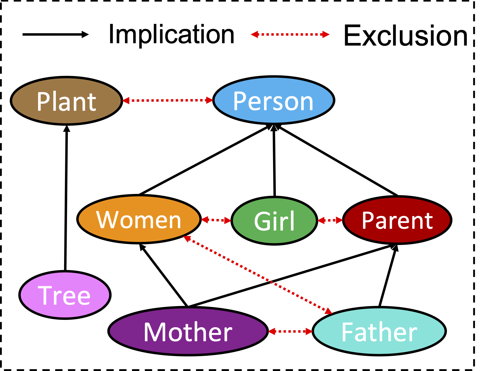
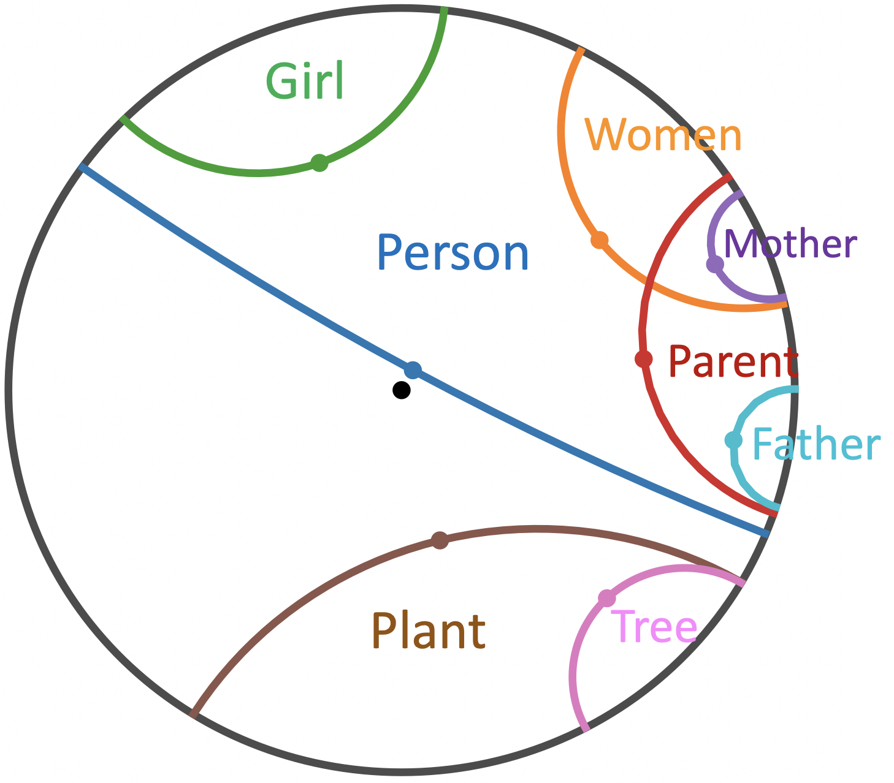

## PyTorch implementation of **Hyperbolic Embedding Inference for Structured Multi-Label Prediction (NeurIPS'22)**
[](https://docs.python.org/3.8/)
[](https://pytorch.org/docs/stable/index.html)
[](https://opensource.org/licenses/MIT)
<!-- [](https://arxiv.org/abs/2107.04894) -->


**Abstract**: We consider a structured multi-label prediction problem where the labels are organized under implication and mutual exclusion constraints. A major concern is to produce predictions that are logically consistent with these constraints. To do so, we formulate this problem as an embedding inference problem where the constraints are imposed onto the embeddings of labels by geometric construction. Particularly, we consider a hyperbolic Poincaré ball model in which we encode labels as Poincaré hyperplanes that work as linear decision boundaries. The hyperplanes are interpreted as convex regions such that the logical relationships (implication and exclusion) are geometrically encoded using the insideness and disjointedness of these regions, respectively. We show theoretical groundings of the method for preserving logical relationships in the embedding space. Extensive experiments on 12 datasets show 1) significant improvements in mean average precision; 2) lower number of constraint violations; 3) an order of magnitude fewer dimensions than baselines.
## Requirements

- torch>=1.8.0
- geoopt (`$ pip install git+https://github.com/geoopt/geoopt.git`)
- numpy
- scipy
- pandas
- tqdm

## HEX graph example

Run HMI-toy-example.ipynb, see the input (left) and output (right)

Hierarchy and exclusion (HEX) graph             |  Learning hyperbolic label embeddings
:-------------------------:|:-------------------------:
   |  


## Multi-label prediction

To run HMI on "derisi_FUN" dataset, run the following scripts:

python run.py --dataset derisi_FUN > logs/derisi_FUN.txt

## Citation

If you find this code useful, please cite the following paper: 
```
@inproceedings{xiong22_neurips_2,
  title = {Hyperbolic Embedding Inference for Structured Multi-Label Prediction},
  author = {Xiong, Bo and Cochez, M. and Nayyeri, Mojtaba and Staab, Steffen},
  year = {2022},
  pages = {},
  booktitle = {Proceedings of the 36th Conference on Neural Information Processing Systems (NeurIPS)}
}
```